## Introduction

Portenta X8 is a powerful, industrial-grade System on a Module with Linux OS preloaded onboard that can run device-independent software thanks to its modular container architecture.

In this user manual, we will go through the foundations of the Portenta X8 to help you understand how the board works and how you can benefit from its advanced features.

## Required Hardware

* [Portenta X8](https://store.arduino.cc/products/portenta-x8) (x1)
* [USB-C® cable (USB-C® to USB-A cable)](https://store.arduino.cc/products/usb-cable2in1-type-c) (x1)
* Wi-Fi® Access Point or Ethernet with Internet access (x1)

## Required Software

* For Linux programming, leverage the latest Linux image available, and check [this section](#portenta-x8-os-image-update) to verify if your Portenta X8 has already been updated.
* For Arduino programming, leverage [Arduino IDE 1.8.10+](https://www.arduino.cc/en/software), [Arduino IDE 2](https://www.arduino.cc/en/software), or [Arduino Web Editor](https://create.arduino.cc/editor), and the latest **Arduino Mbed OS Portenta Boards** Core > 3.0.1.

## Product Overview

The Portenta X8 combines the best of two approaches, offering the flexibility of Linux and the capability for real-time applications within the Arduino environment. Developers can execute real-time tasks while simultaneously handling high-performance processing on Linux cores.

So, let's have a look at its technical specifications.

### Board Architecture Overview

Portenta X8 is a powerful, industrial-grade System on a Module that combines a Yocto Linux distribution with the well-known Arduino environment.


As reported in the image above, Portenta X8 features two powerful computing units:

* **NXP® i.MX 8M Mini** Cortex®-A53 quad-core up to 1.8GHz per core + 1x Cortex®-M4 up to 400 MHz. This microprocessor is the one where the Yocto Linux distribution is running together with Docker containers (check [this section](#linux-environment) of this user manual to learn more).

* **STMicroelectronics STM32H747XI** featuring 1x Arm® Cortex®-M7 core running up to 480 MHz and 1x Arm® Cortex®-M4 core running up to 240 MHz. This microcontroller hosts the ["Arduino Mbed OS Portenta Boards" Core](https://github.com/arduino/ArduinoCore-mbed). M4 core is accessible and programmable by the user, while M7 is dedicated to establishing and guaranteeing the communication between i.MX 8M Mini and M4, as well as to manage peripherals through RPC. For more details, refer to [this section](#arduino-environment) of the user manual.

The two computing units are responsible for different tasks, which are summarized in the table below.

| **NXP® i.MX 8M Mini**                                   | **STMicroelectronics STM32H747XI (M4)**                        |
|---------------------------------------------------------|----------------------------------------------------------------|
| Running Yocto Linux distribution with Docker containers | Running Arduino sketches with the Mbed OS Portenta Boards Core |
| Dedicated to high level tasks                           | Dedicated to real-time tasks                                   |
| Manage network connectivity                             | No direct connection to any network stack                      |
| Manage network-based buses (e.g., Modbus TCP, etc.)     | Manage field buses (e.g., Modbus RTU, CANbus, etc.)            |
| Access to peripherals without concurrent access control | Access to peripherals without concurrent access control        |

In addition to the above features, here is an overview of the board's main components:

* **External memory**: The board features an onboard 16 GB eMMC Flash memory and 2 GB Low Power DDR4 DRAM.

* **Wireless connectivity**: The board supports 2.4 GHz Wi-Fi® (802.11 b/g/n) and Bluetooth® 5.1, provided by the Murata® 1DX module. This high-performance Wi-Fi® and Bluetooth® module allows the Portenta X8 to communicate wirelessly with other devices and systems.

* **Ethernet connectivity**: The board features an onboard, high-performance 1 Gbps Ethernet transceiver accessible through its High-Density connectors.

* **Secure element**: The board includes a ready-to-use secure element, the SE050C2 from NXP®, tailored for IoT devices and offering advanced security features. This allows Portenta X8 to achieve PSA certification from ARM®. For more information, click [here](https://www.psacertified.org/products/portenta-x8/).

* **USB connectivity**: The board features a USB-C port for power and data, which is also accessible through the board's High-Density connectors. This port is linked to a MIPI to USB-C/DisplayPort converter, enabling video output through the USB-C connection.

* **Power management**: The Portenta X8 includes a power management integrated circuit (PMIC) to meet the demands of always-connected IoT devices.

### Pinout


The full pinout is available and downloadable as PDF from the link below:
* [Portenta X8 Pinout](https://docs.arduino.cc/static/019dd9ac3b08f48192dcb1291d37aab9/ABX00049-full-pinout.pdf)

### Datasheet

The full datasheet is available and downloadable as PDF from the link below:
* [Portenta X8 Datasheet](https://docs.arduino.cc/resources/datasheets/ABX00049-datasheet.pdf)

### Schematics

The full schematics are available and downloadable as PDF from the link below:
* [Portenta X8 Schematics](https://docs.arduino.cc/resources/schematics/ABX00049-schematics.pdf)

### STEP Files

The full _STEP_ files are available and downloadable from the link below:
* [Portenta X8 STEP files](../../downloads/ABX00049-step.zip)

### Features Overview

Portenta X8 integrates two main programming experiences: the **Yocto Linux** and popular **Arduino** environments.


To explore specific sections in more detail, please click on the links below that interest you:

* [Linux Environment](#linux-environment)
* [Arduino Environment](#arduino-environment)
* [Arduino Cloud](#portenta-x8-with-arduino-cloud)

### Linux and Arduino Environment on Portenta X8

The Portenta X8 runs a **Yocto** based Linux distribution. It allows users to upload sketches to the M4 core of the STM32H7 using the Arduino IDE. The process of uploading sketches may seem familiar to Arduino users, but on Portenta X8, the system uses a service called `monitor-m4-elf-file.service`. This service monitors a specific directory for updated sketches and flashes the M4 core with the new code via OpenOCD. This feature enables seamless integration between the Linux and Arduino environments on the board.

The Portenta X8 employs **Remote Procedure Call (RPC)** mechanisms to enable communication between the Linux system and the Arduino cores. RPC allows the two processors (M4 and M7 cores) to exchange data, with the M7 core handling data transfers between the M4 core running Arduino sketches and the Linux environment.

The communication uses **MessagePack-RPC**, a lightweight protocol for serialized data transfer, supporting various communication protocols like OpenAMP, SPI, and TCP/IP. This setup ensures efficient interaction between the Linux side and Arduino sketches without the complexity of traditional dual-core processing.

The Portenta X8 offers a powerful, versatile platform by combining Linux capabilities with Arduino’s ease of use. Users can deploy and manage device-independent applications using Docker containers while also taking advantage of Arduino’s rich ecosystem for embedded development. This hybrid environment supports flexible development, making it ideal for complex, multifunctional projects.

***For more in-depth details on fundamentals of the Portenta X8, please refer to this [tutorial](https://docs.arduino.cc/tutorials/portenta-x8/x8-fundamentals/).***

## Portenta X8 OS Image Update

It is recommended that you check every now and then to see if your Portenta X8 image version is up to date to have the latest security updates.

In the next sections, four major ways to update your Portenta X8 are described:

* Update for OS release V.399
* Update through Out-of-the-box experience (available for OS release XXXX or newer)
* Update through Portenta X8 Manager in your Arduino Cloud for Business account (available for all OS releases)
* Update using the `uuu` tool (compatible with custom images)

### Check Portenta X8 OS Release

To verify which OS release is flashed on your Portenta X8, you need to connect to your board through **ADB**, as explained in [this section](#working-with-linux) of this user manual.

You can type `cat /etc/os-release` in your command line window to get the OS release currently running on your device.


As shown in the image above, the OS release of this Portenta X8 corresponds to `IMAGE_VERSION=569`.

### Update For OS Release V.399

If your Portenta X8 is flashed with the OS release V.399 and you have a carrier compatible with Portenta X8 (like Portenta Breakout). In that case, we recommend you update it to the latest image release by following [this tutorial](https://docs.arduino.cc/tutorials/portenta-x8/image-flashing#flashing-mode-with-carrier).

Otherwise, you can also open a new Command Line window and connect to your Portenta X8, as explained [here](#working-with-linux). At this point, verify that your Portenta X8 is connected to the Internet and type the following commands:

```bash
wget https://downloads.arduino.cc/portentax8image/399-install-update
```

```bash
chmod +x 399-install-update
```

```bash
sudo ./399-install-update
```

Now, you need to reboot the board by pressing its pushbutton for around 10 seconds. After that, connect again to your Portenta X8 through the Command Line and type the following commands:

```bash
wget https://downloads.arduino.cc/portentax8image/399-finalize-update
```

```bash
chmod +x 399-finalize-update
```

```bash
sudo ./399-finalize-update
```

These commands will make your V.399 compatible with the [aklite-offline](https://docs.foundries.io/latest/user-guide/offline-update/offline-update.html) tool. They will then allow you to update your Portenta X8 to the latest image version of Arduino released.

Arduino provides this tool for free for any Portenta X8 user to enable offline secure updates to all devices, even if those devices are not connected to any FoundriesFactory.

After the update process is finalized, your Portenta X8 will start running the latest OS release immediately.

### Update Through Out-Of-The-Box Experience

Leverage the integrated Out-of-the-box experience to update your Portenta X8 to the latest release.

***Warning: The Out-of-the-box update feature is not a complete Over-The-Air (OTA) update. It allows users to update only the Portenta X8 default image and containers. It will overwrite any custom container application. Thus, it is recommended to make a local copy of your containers before updating your Portenta X8.***

Open your Out-of-the-box as explained in [this section](#first-use-of-your-portenta-x8).


Click on **CHECK FOR UPDATES** in the lower right corner.

At this point, you have to select whether you would like to proceed with the update. If yes, click on **UPDATE**.


Please do not turn off your Portenta X8 or disconnect it from the network during the update. This process may take a few minutes.


Once the update is finished, your Portenta X8 will automatically restart with the new Linux image in place.

At this point, if you want to continue using your Out-of-the-box, you can open a new command line window and launch the command `adb forward tcp:8080 tcp:80` again. Now open your browser, go to [http://localhost:8080](http://localhost:8080), and the same Out-of-the-box dashboard will appear.

#### Troubleshooting

If something goes wrong during the update, you can manually flash your Portenta X8 with the latest Linux image provided at [this link](https://github.com/arduino/lmp-manifest/releases).

You can follow [this section](#update-using-uuu-tool) to learn to use the `uuu` tool and update your device manually with the latest OS Image version. Follow [this dedicated tutorial](https://docs.arduino.cc/tutorials/portenta-x8/image-flashing) to learn how to flash your device manually.

### Update With Portenta X8 Board Manager

If you have an *Arduino Cloud for business* account with the Portenta X8 Manager, check if the target installed on your Portenta X8 is the latest one available in your FoundriesFactory.  


If this is not the case, you can update your device using FoundriesFactory **Waves** functionality. Check [this tutorial](https://docs.arduino.cc/tutorials/portenta-x8/waves-fleet-managment) to read the complete instructions.

More information about Waves can be found in the official Foundries documentation at [this link](https://docs.foundries.io/latest/reference-manual/factory/fioctl/fioctl_waves.html?highlight=wave).

### Update Using `uuu` Tool

An alternative method to update the Portenta X8 with the latest OS image is to use the `uuu` tool (or `uuu_mac` for macOS). This approach is particularly useful for users who have built a custom image or prefer a manual update process. The image files can be downloaded from the [Arduino repository](https://downloads.arduino.cc/portentax8image/image-latest.tar.gz) and extracted into a specific directory.

Depending on the carrier being used (e.g., Max Carrier, Breakout, Hat, or Mid Carrier), DIP switch settings must be adjusted to enter programming mode or specific commands can be executed via ADB for a barebone setup. Once the board is in programming mode, you can navigate to the extracted image files and run the `uuu full_image.uuu` command to begin the flashing process.

If not using a carrier, ensure the tool is running before cycling the power on the Portenta X8. Upon successful completion, reset the DIP switches or recycle the power to confirm the update.

***For a detailed guide, refer to the [Flashing Portenta X8 tutorial](https://docs.arduino.cc/tutorials/portenta-x8/image-flashing).***

## First Use Of Your Portenta X8

You can now start interacting with your Portenta X8. Portenta X8 has an embedded configuration console that will guide you step-by-step in configuring your board.  

### Power The Board

Connect the Portenta X8 to your PC via a USB-C® cable (either USB-C® to USB-A or USB-C® to USB-C®).

Once connected, you will see the Portenta X8 LEDs start blinking. Portenta X8 features two LEDs, a Power LED, and a Status LED, which can blink in parallel.

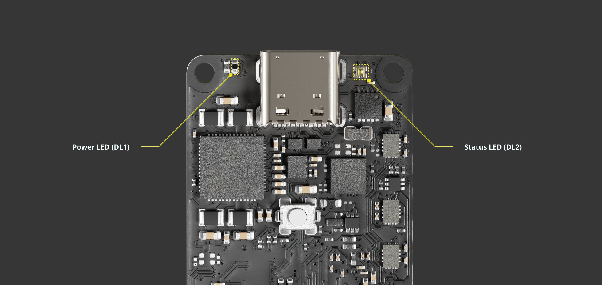

The table below describes the meaning and functionalities of LEDs.

| **LED Type** | **Colour** | **Meaning**                                     |
|--------------|------------|-------------------------------------------------|
| Power LED    | Red        | Power ON                                        |
| Status LED   | White      | OS booting in progress                          |
| Status LED   | Blue       | Linux Kernel running                            |
| Status LED   | Green      | Board connected to the Internet                 |
| Status LED   | Red        | STM32H7 LED, blinking when triggered in the IDE |

### Setup with the Arduino Linux Wizard

***It is recommended that you have your Portenta X8 with the latest OS version. Check [this section](#portenta-x8-os-image-update) to learn how to have your Portenta X8 up-to-date.***

Once the Portenta X8 is correctly powered up, you can start interacting with it. 

Open your browser and navigate to [www.arduino.cc/start](www.arduino.cc/start). The following page will be displayed.


Click on **Linux boards** and sign in to your Arduino Cloud account. If you do not have an account, create a new one from the same webpage.


When successfully logged in, you will be asked to download the Arduino Create Agent if you have not done so yet. Click on **DOWNLOAD**.

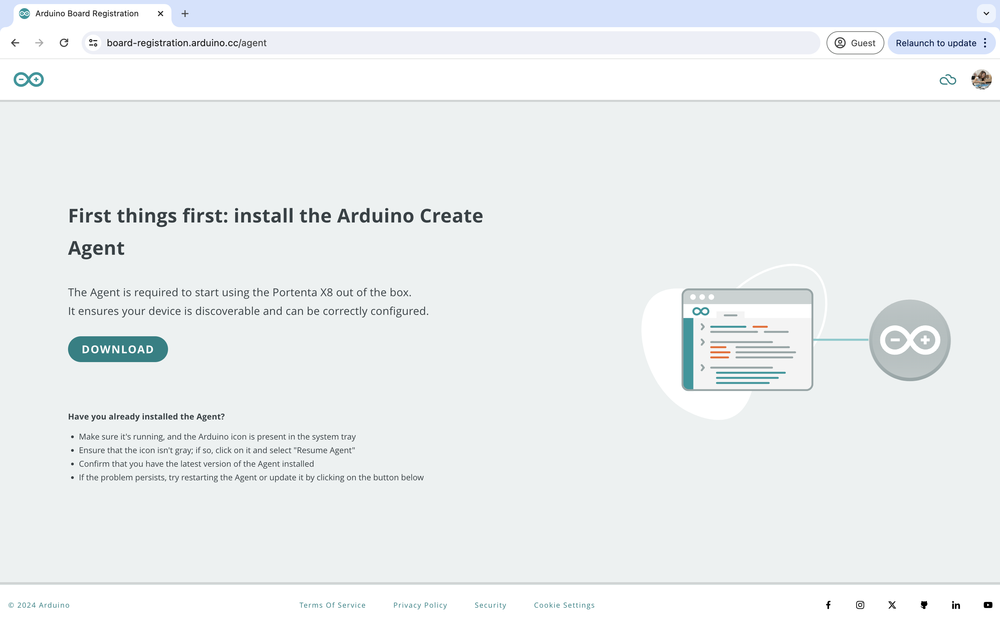

The agent will be installed on your computer. This activity might take a few minutes. Once installed, your Portenta X8 will be automatically detected by your PC after a few seconds.

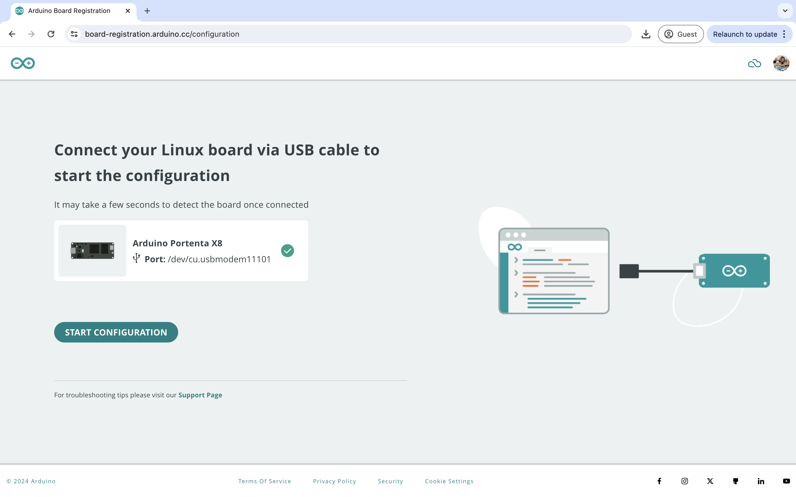

Now click on **START CONFIGURATION**. The tool will install all the required add-ons to make your Portenta X8 work efficiently with your PC via serial communication.

You can now proceed to the setup of the board connectivity by clicking **OK, GOT IT**. 


***If you face any issue with this flow or prefer to interact directly with your Portenta X8 through the command line, please refer to [this section](#working-with-linux) to learn how to connect with the board leveraging ADB service.***

#### Wi-Fi® Configuration

Click **Wi-Fi® Connection** to start configuring your network connectivity. Otherwise, you can connect your Portenta X8 to the Internet through an Ethernet cable using a USB-C® hub with an RJ45 port or a Portenta Carrier. In this tutorial, Wi-Fi® connectivity will be used.


Select your Wi-Fi® SSID. You can select a network from the available list or introduce your SSID manually.

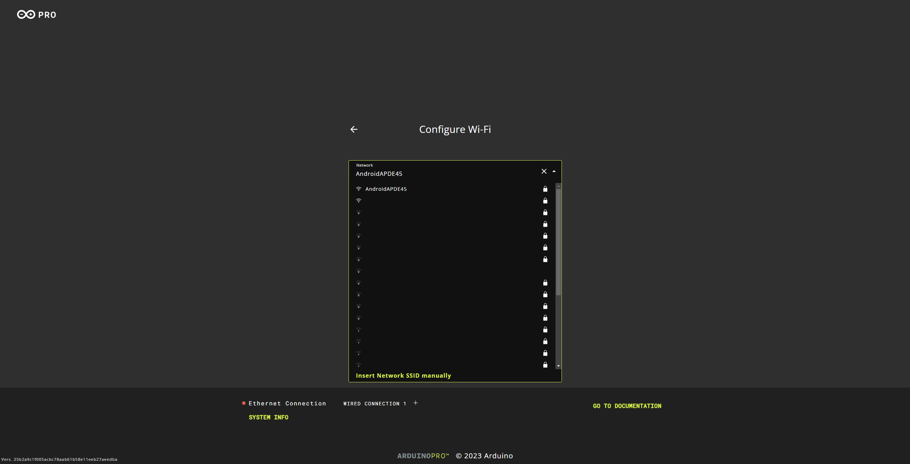

Type your Wi-Fi® password.

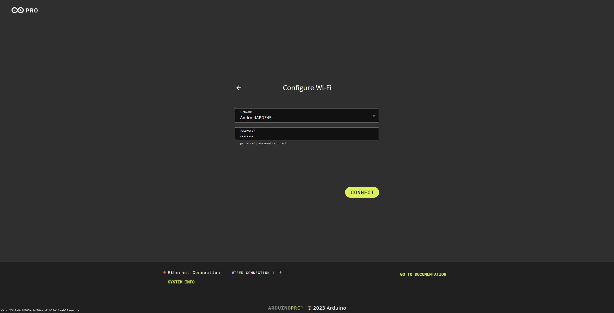

Once connected, you will get a notification confirming your Portenta X8 has connected to the selected network, and its LED will start blinking green.

Moreover, you can check the network you are connected to in the bottom left section of this dashboard.

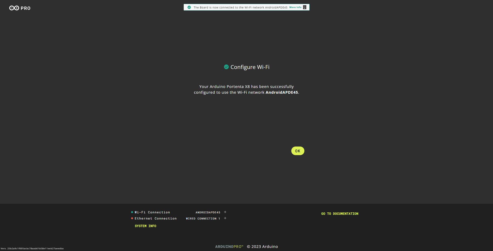

Now, you can click **OK** and be redirected to the Out-of-the-box homepage below.


***You can change your network by clicking on the Settings button and repeat the steps above.***

#### Arduino Linux Wizard Homepage

This web page is hosted on the Portenta X8 and allows a user to:

- Get board details
- [Configure Portenta X8 Wi-Fi®](#wi-fi-configuration)
- [Interact with the board through the embedded Python® Alpine Shell](#portenta-x8-with-python-alpine-shell)
- [Provision your device to Arduino Cloud](#portenta-x8-with-arduino-cloud)
- Manage the Linux distribution with the dedicated [Portenta X8 Board Manager](#portenta-x8-board-manager)

#### Portenta X8 with Python Alpine Shell

Click the **Shell** button to start using your Portenta X8 with Python-Alpine.


This shell is running in a Python-Alpine container embedded in Portenta X8. You will find multiple examples under the directory `/root/examples` in this shell. Additionally, you can either add your own package through the command `apk add <packagename>` or start exploring the packages available online at [this link]( https://pkgs.alpinelinux.org/packages).

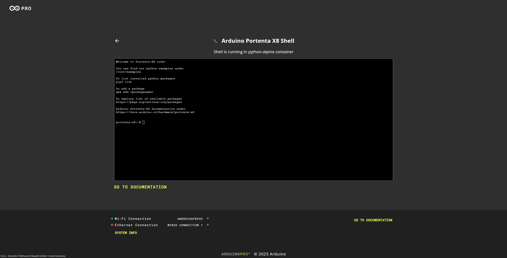

#### Portenta X8 with Arduino Cloud

***Note: this is an optional step. The Portenta X8 can also be used with a local IDE without an internet connection.***

Making Portenta X8 compatible with Arduino Cloud means opening many new applications. This compatibility is guaranteed by a brand-new Python container, which includes a dedicated [Arduino IoT Cloud Python library](https://github.com/arduino/arduino-iot-cloud-py). Through Arduino Cloud APIs, the Python container ensures full interaction and simple porting of any Python developed application in the Arduino Cloud.

***Check all the available Arduino Cloud plans [here](https://cloud.arduino.cc/plans#business) and create your Arduino Cloud account in a couple of steps (see the dedicated documentation at [this link](https://docs.arduino.cc/arduino-cloud/)).***

With the Out-of-the-box experience, your Portenta X8 can be securely self-provisioned in Arduino Cloud; you need to create API keys, and the Python container running on X8 will do the rest. When provisioned, you can start directly interacting with an example Thing and Dashboard that will be automatically generated to guide you in this new journey.

Click the **Arduino Cloud** button to start provisioning your Portenta X8 in Arduino Cloud.

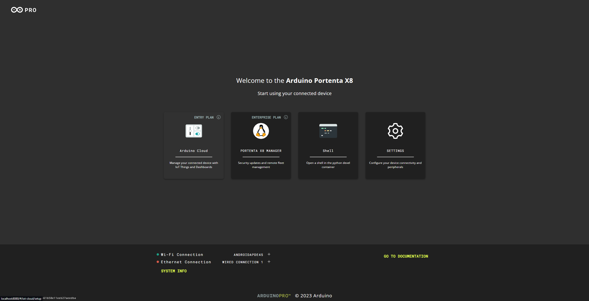

Start setting up the device name for your Portenta X8 (in this case, *portenta-x8-test*) and click on **CONTINUE**. The same device name will be used and visualized in your Arduino Cloud space, but you can freely change it in the future.

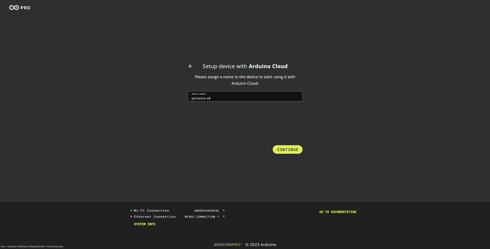

At this point, you will be asked to insert your API Key credentials and Organization ID. Organization ID is optional and should be filled in only if you use a Shared Space in Arduino Cloud for Business.


To get API keys, log into your Arduino Cloud account and select the Space you would like your X8 to be provisioned into.

Thus, click on **GENERATE API KEY** in your Out-of-the-box dashboard. A new window in your web browser will allow you to log in to your Arduino Cloud space.

***If you want to learn more about what API keys are and how they work, please take a look at the dedicated documentation available at [this link](https://docs.arduino.cc/arduino-cloud/getting-started/arduino-iot-api).***


Click on **SIGN IN**. If you do not have an Arduino Cloud account, create a new one from the same webpage.

Sign in to your Arduino Cloud account by adding your credentials, i.e., Username/email and Password.


You are now logged into your Arduino Cloud space. Go on by clicking on **API keys** within the account banner in the top right corner.


It is time to generate your API keys. Click on **CREATE API KEY** in the upper right-hand corner.


Define a name for your API key, in this case, *portenta-x8-test-API*, and click on **CREATE**. These API keys are personal and visible only from your account.


At this point, your API key has been created. Save the correspondent credentials in a safe storage space by clicking on **download the PDF**.

Keep this file safely stored; otherwise, your API credentials cannot be recovered. If you lose it, you will have to generate new API keys by repeating the above procedure.


The PDF file will look like the image below and include the credentials you need to copy and paste into the Out-of-the-box page.


Thus, copy the **Client ID** and the **Client Secret** credentials and paste them into your Out-of-the-box dashboard as shown below.


If you are using an Arduino Cloud for Business account with Shared Spaces. In that case, you also need to add the Organization ID you would like your Portenta X8 to be provisioned into by clicking on **ADD ORGANIZATION**.


To recover the Organization ID, known as Space ID, of your Shared Space on Arduino Cloud for Business, open your Arduino Cloud homepage and navigate to **Space Settings > General** in the sidebar on the left.


At this point, you can copy the **Space ID** of your Shared Space and paste it into your Out-of-the-box dashboard together with your API keys.

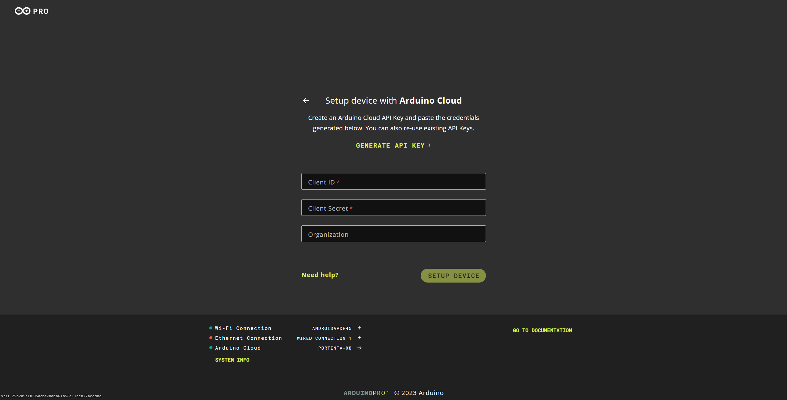

Click on **SETUP DEVICE**, and you are ready to go, your Portenta X8 is now provisioned into your Arduino Cloud space.


Once provisioned, the Portenta X8 will be automatically linked to an example [Thing](https://create.arduino.cc/iot/things) and [Dashboard](https://create.arduino.cc/iot/dashboards). You can freely check them by clicking on the corresponding links embedded in the Out-of-the-box.


As mentioned, Arduino provides an example dashboard that will automatically set up and be visible live after your Portenta X8 has been provisioned. To make this dashboard update its data automatically, you need to go back to your Out-of-the-box and launch the example.

To do so, copying the shown code `python3 examples/arduino_iot_cloud_example.py` and clicking on **Launch Example** is sufficient. An Alpine-Python shell will open, and you will have to paste the previous code here to launch the example.

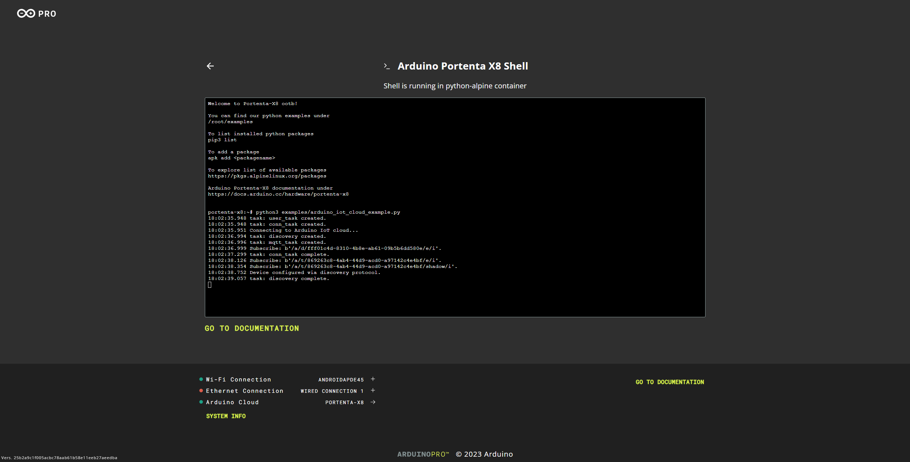

Now, you can navigate to your dashboard [here](https://create.arduino.cc/iot/dashboards) to see your Portenta X8 LED blinking and the live temperature inside the microprocessor.


***If you face any issues during the provisioning of your Portenta X8, feel free to repeat the procedure above.***

***If you would like to customize your Portenta X8 Things/Dashboards with your custom data, check [this section](#working-with-arduino-cloud) of the user manual.***

#### Portenta X8 Board Manager

***Note: this is an optional step. Although the Portenta X8 Board manager opens a wide range of possibilities that are important for business applications, the Portenta X8 can be used for free without the need for any additional paid license***

Now, you can start connecting your Portenta X8 to the Portenta X8 Board Manager. You need an Arduino Cloud for your business account to leverage this feature.

Check the Arduino Cloud for business plan with Portenta X8 Manager [here](https://cloud.arduino.cc/plans#business) and create your Arduino Cloud account in a couple of steps (see the dedicated documentation at [this link](https://docs.arduino.cc/arduino-cloud/)).

When your Arduino Cloud for business account is correctly set up, log into it [here](https://cloud.arduino.cc/home/) and click on **Portenta X8 Board Manager**. The feature is located within the **Integrations** section of the Cloud.


At this point, you will be asked to create a new account on [Foundries.io](https://foundries.io/) platform. It is recommended to register with the same email address you are currently using in your Arduino Cloud for business account.


Add all your credentials and click on **Sign up**.


So, let's create your brand new FoundriesFactory. Select **Arduino Portenta X8**, define a **Factory name** for your Factory, and then click on **Create Factory**.


Your FoundriesFactory is correctly set up. As you can see, the Factory does not have any device connected to it.


To provision your Portenta X8, go back to your Out-of-the-box webpage and click on the **Portenta X8 Manager** button.


Enter the Factory name you have just registered, in this case, *user-test*, and assign a Board Name to your Portenta X8. This Board Name will be used to correctly identify your Portenta X8 in your FoundriesFactory. You can now click on **REGISTER**.


To complete the registration of the Board with the FoundriesFactory, copy the code that appeared in your Out-of-the-box.


Click on **COMPLETE REGISTRATION** to be re-directed to the Foundries.io activation page.

Paste your token in the text box and press **Next**.

***The token code is valid for 15 minutes; if you do not paste it in this time span, you will have to repeat all the above registration steps in your Out-of-the-box to generate a new code.***


Confirm the addition of your Portenta X8 by pressing **Connect**.


Go to your FoundriesFactory by clicking on **Factories Page**.


Now you will see the number of devices associated with your FoundriesFactory to be equal to 1.


Your Portenta X8 is correctly provisioned into your FoundriesFactory.

To verify your device status, click on your FoundriesFactory, go to the **Devices** section, and check its target update and the installed containers Apps.


***If you want to learn more about Portenta X8 Manager features, check the dedicated section of this user manual called [Working with Portenta X8 Board Manager](#working-with-portenta-x8-board-manager).***

## Working with Linux

It is time to start interacting with the Linux OS embedded in your Portenta X8. To do that, you need to open your terminal window and look for [**ADB**](https://developer.android.com/studio/command-line/adb) inside the directory **Arduino15/packages/arduino/tools/adb/32.0.0**. The Arduino15 folder may have a different location depending on your Operating System. Check [this article](https://support.arduino.cc/hc/en-us/articles/360018448279-Open-the-Arduino15-folder) to learn where your Arduino15 folder is located.

Android Debug Bridge (ADB) is a tool included in the SDK software (Software Development Kit) and used, among other things, to make an Android device and a computer communicate. To check if ADB is working correctly, you can type `adb devices`. Your Portenta X8 will be listed there.


***If you need to install ADB, you can also download the right tool for your Operating System directly from the [official Android website](https://developer.android.com/studio/releases/platform-tools).***

If you want to start the embedded Arduino Linux Wizard from the command line, you can continue typing in your terminal:

```bash
adb forward tcp:8080 tcp:80
```

With this command, ADB allows you to forward the requests of your computer's `8080 TCP-IP port` to the `80 TCP-IP port` of your device, which, in this case, is the device with the name *Portenta X8*.


Now you can open your browser, go to [http://localhost:8080](http://localhost:8080) and the same Arduino Linux Wizard dashboard will appear to allow you to configure your Portenta X8.


Now, you can type `adb shell` to start communicating with your Portenta X8.


As it is a Linux device, you can create files, change directories, etc.

To gain admin (root) access, type `sudo su -`. The terminal prefix should turn red.

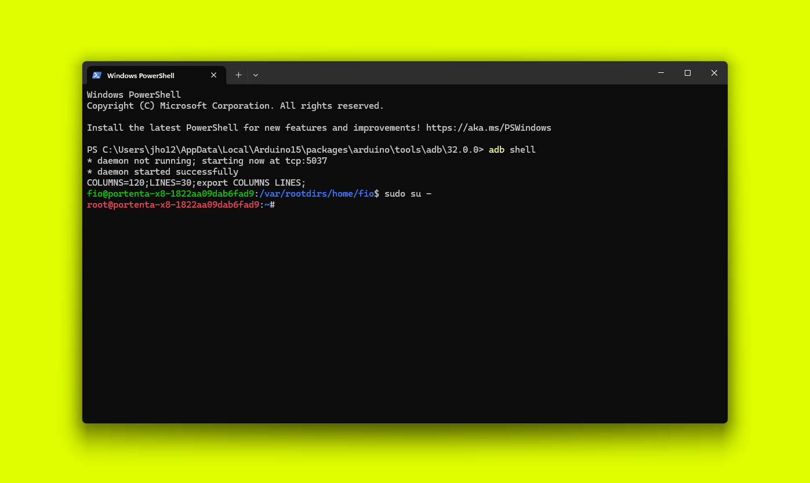

You can now freely program your Portenta X8 Linux OS. In the sections below, you can check out some basic commands to get started.

### Manage Your Network Via CLI

To connect to a Wi-Fi® Access Point via CLI, you can use the network manager tool **nmcli**. These are some of the most used commands:

* `nmcli device wifi connect <SSID> password <PASSWORD>` to connect to a specific SSID
* `nmcli de` to check the connection status
* `nmcli connection show` to visualize the active network interfaces (and their types) on your Portenta X8

### Accessing Over SSH Session

Establishing communication with the Portenta X8 via an SSH session is possible. To do so, a network connection is needed, either over Wi-Fi® or Ethernet. Using a device with DHCP server capabilities, such as a network router, is recommended for Ethernet connections. After setting up the network connection and DHCP, the Portenta X8 will be ready for SSH communication.

For Windows users, it is necessary to install a service tool to ease the following procedures. While Bonjour, Apple's implementation of zero-configuration networking, comes built into macOS, it is not natively included in Windows and must be installed separately.

***Before proceeding on __Windows__, please install [Bonjour Print Services for Windows](https://support.apple.com/kb/DL999?locale=en_US) before continuing the following steps.***

For macOS and Linux users, *Bonjour* is pre-installed on macOS, and *Avahi-Browse* is typically available on Linux by default. Thus, additional installation steps may be unnecessary for these operating systems.

In the subsequent sections, we will first walk you through the process on Windows, followed by details and instructions for Linux and macOS.

#### Using the Terminal


The command below is used to browse for SSH services on the local network that are advertised over a multicast Domain Name System (mDNS). This protocol resolves hostnames to IP addresses within small networks without a local name server.

```bash
dns-sd -B _sftp-ssh._tcp local
```

By executing this command, you can discover devices offering _SFTP services_ (file transfer over SSH) without prior knowledge of their IP addresses or hostnames.

The command lists these services, indicating where an SSH connection can be established for secure file transfers or shell access, helping to ease the identification and utilization of networked devices that support this protocol.


```bash
dns-sd -G v4v6 portenta-x8-<UUID>.local
```

The command above queries the network for the _IPv4_ and _IPv6_ addresses associated with the hostname `portenta-x8-<UUID>.local`. The _UUID_ can be found within the instance name listed previously or if you have accessed the Portenta X8 via an ADB shell. An example command would look as follows:

```bash
dns-sd -G v4v6 portenta-x8-1822aa09dab6fad9.local
```

This command is handy for finding the IP addresses of devices such as the Portenta X8 that a DHCP server may assign dynamic IP addresses. It simplifies connecting to such devices over the network by providing their current IP addresses.


The following command sends echo requests to the device with the hostname `portenta-x8-<UUID>.local` to check its network availability and measure round-trip time.

```bash
ping portenta-x8-<UUID>.local
```

This command helps verify that the Portenta X8 is online and reachable over the network and for diagnosing connectivity issues. The UUID can be ascertained by referring to the findings from an earlier SSH services scan with network query or the ADB shell.


After verifying that the Portenta X8 is accessible using a simple ping test, it is now possible to start an SSH session using the following command:

```bash
ssh fio@portenta-x8-1822aa09dab6fad9.local
```

The example command above starts an SSH (Secure Shell) connection to the Portenta X8 with the hostname `portenta-x8-1822aa09dab6fad9.local` using the username `fio`. The command format should be as follows:

```bash
ssh fio@portenta-x8-<UUID>.local
```

When executing the command, substitute the `<UUID>` placeholder with the actual UUID of the Portenta X8 you are attempting to connect to. You can confirm this UUID by checking the results of a prior SSH services scan with a network query or ADB shell.

If the device is configured correctly to accept SSH connections and the *`fio`* account exists with SSH access, this command will prompt for the password associated with the *`fio`* user.

Upon successful authentication, it will open a secure shell session to the device, allowing for command-line interface access and the execution of commands remotely on the Portenta X8.

The password and the rest of the configuration for using the Portenta X8 inside the shell remain the same.

The process is similar for *GNU/Linux* and *macOS*, with minor differences in the initial steps when browsing for SSH services on the local network.

- **For GNU/Linux**:

Use *Avahi-Browse* to search for SSH services on the local network:

```bash
avahi-browse -d local _sftp-ssh._tcp --resolve -t
```

- **macOS**:

On macOS, you can use the similar command:

```bash
dns-sd -B _sftp-ssh._tcp local
```

Alternatively, you can use a software called *Discovery*, which is available [here](https://apps.apple.com/it/app/discovery-dns-sd-browser/id1381004916?l=en&mt=12).

#### Using Software With GUI

The SSH session can be initialized using third-party software with a Graphical User Interface (GUI) for easy access. An example is a software called *Bonjour Browser*, which can be downloaded [here](https://hobbyistsoftware.com/bonjourbrowser).


This software simplifies browsing SSH services on the local network advertised over mDNS using a GUI. The image above, for example, shows all available services on the network, including those for the Portenta X8. You can retrieve the IP address information by simply clicking on a service item.

Once the information is verified, you can use that data with software such as [*PuTTY*](https://www.putty.org/). *PuTTY* is a free and open-source terminal emulator, serial console, and network file transfer application. It supports several network protocols, including *SSH (Secure Shell)* and *SFTP (SSH File Transfer Protocol)*.


In the PuTTY Configuration window, keeping the default values, you must specify the _Host Name (or IP address)_ field with `portenta-x8-<UUID>`. For instance, you would use:

```
portenta-x8-1822aa09dab6fad9
```

Click on `Open`, and it will prompt a security alert. It displays information about the connection, including fingerprint details. Depending on your connection profile preference, you can choose to `Accept` or `Connect Once`.


After verifying the security alert and proceeding, you have an SSH session that has begun communicating with the Portenta X8.


### Inspect Real-Time Tasks And Logs Via CLI

Run `journalctl -f` to check the status of active services and possibly their errors, as well as various system event logs.


By calling `journalctl`, it is possible to look at the log of all the running activities by specifying the type of log you are looking for. Some logs may be a warning that can be ignored, while some may be critical errors. Type `journalctl -p 0` to view emergency system messages; otherwise, change the number 0 with the error code you want to investigate according to the following error code numbers:

| **Error code** | **Meaning** |
|----------------|-------------|
| 0              | Emergency   |
| 1              | Alerts      |
| 2              | Critical    |
| 3              | Errors      |
| 4              | Warning     |
| 5              | Notice      |
| 6              | Info        |
| 7              | Debug       |

When you specify the error code, it shows all messages from that code and above. For example, if you specify error code 2, it shows all messages with priority 2, 1 and 0.

You can also view logs for a specific time and date duration. You can use the `-- since` switch with a combination of `"yesterday"`, `"now"`, or a specific date and time `"YYYY-MM-DD HH:MM:SS"`.

An example of how to use the command:

```bash
journalctl --since "2022-12-22 12:20:00" --until yesterday
```

### Create And Upload Docker Containers To Portenta X8

We created dedicated tutorials covering this topic. Go check them out:

* [Managing Containers with Docker on Portenta X8](https://docs.arduino.cc/tutorials/portenta-x8/docker-container)
* [Deploy a Custom Container with Portenta X8 Manager](https://docs.arduino.cc/tutorials/portenta-x8/custom-container)
* [Running Wordpress & Database Containers on Portenta X8](https://docs.arduino.cc/tutorials/portenta-x8/wordpress-webserver)

### Output Video Content On A Screen

The USB-C® port on your Portenta X8 supports video output. Consequently, you can connect a USB-C® monitor or a USB-C® to the HDMI hub to your Portenta X8 to start visualizing video or other visual renders.

Here you can find a list of validated compatible USB-C® to HDMI hubs:

* [TPX00145](https://store.arduino.cc/products/usb-c-to-hdmi-multiport-adapter-with-ethernet-and-usb-hub)
* [TPX00146](https://store.arduino.cc/products/usb-c-to-hdmi-multiport-adapter-4k-usb-hub-pd-pass-through)

***Learn more on how to output WebGL content on a screen with Portenta X8 by checking the [dedicated tutorial](https://docs.arduino.cc/tutorials/portenta-x8/display-output-webgl).***

### Build A Custom Image For Portenta X8

You may want to build a custom image for the Portenta X8 with the source code provided in the public [GitHub repository of lmp-manifest](https://github.com/arduino/lmp-manifest/). Building an image locally can help debug certain aspects of the system, such as the bootloader or kernel support.

***Have a look at [this dedicated tutorial](https://docs.arduino.cc/tutorials/portenta-x8/image-building) to understand how to build your own custom image.***

### Interacting with Tenta-Config

**tenta-config** is a configuration tool for managing hardware settings and device tree overlays on compatible carriers. It provides a graphical interface for customizing system configurations with compatible carriers, such as peripheral management, adjusting video output settings, and managing pin mappings.


The image above shows the main window when accessing the `tenta-config`. It lists all compatible carriers, the option to automatically probe the attached carriers, and additional operations for debugging and configuring purposes for the Portneta X8.

This tool simplifies hardware customization, allowing users to modify their setup without modifying the core device tree, which is essential for tasks like configuring display settings or activating specific hardware features.

To access the `tenta-config` window, please follow these instructions.

First, access the Docker container named **x8-devel** with the following command:

```bash
docker exec -it x8-devel sh
```

This command uses **docker exec** to start a new shell session inside the running **x8-devel** container. The `-it` flags provide an interactive terminal session for executing commands within the container. This is useful for development, enabling direct code editing, monitoring processes, or debugging in an isolated environment.

Next, search for the **tenta_runner** Python script by running:

```bash
find / -name *.py
```

This command recursively searches from the root directory for any Python script, helping locate utilities or applications spread across the system.

Once you find **tenta_runner.py**, navigate to its directory using:

```bash
cd /root/examples/tenta-config
```

Then run the script:

```bash
python tenta_runner.py
```

This command launches a GUI within the `tent` framework, opening the `tenta-config` window as seen in the image below:


If you have a Pro 4G Module or a GIGA Display Shield with the Portenta Mid Carrier, you can choose the `Portenta Mid Carrier` option and set the necessary overlays to prepare essential environment configuration with a few steps.

You can find more information on how to use the `tanta-config` to set up the Pro 4G Module [here](https://docs.arduino.cc/tutorials/portenta-mid-carrier/user-manual/#using-linux-4) and the GIGA Displaye Shield [here](https://docs.arduino.cc/tutorials/portenta-mid-carrier/user-manual/#giga-display-shield-connector-j19).

### Additional Tutorials

If you want to continue working with your Portenta X8, you can find tons of additional tutorials in the **Tutorials** section of our [Arduino Docs](https://docs.arduino.cc/hardware/portenta-x8). Please go check them out!

## Working With Arduino Sketch

In this section, you will learn how to upload a sketch to the M4 core on the STM32H747XI MCU.

Open the Arduino IDE and download the latest **Arduino Mbed OS Portenta Boards Core**. Learn how to do it by following [this tutorial](https://docs.arduino.cc/software/ide-v1/tutorials/getting-started/cores/arduino-mbed_portenta).

Select Portenta X8 in the board selector.


Create a custom sketch or open one of the example sketches, e.g., the blink sketch:

```arduino
void setup(){
 pinMode(LED_BUILTIN ,OUTPUT);
}

void loop(){
 digitalWrite(LED_BUILTIN , HIGH);
 delay(1000);
 digitalWrite(LED_BUILTIN , LOW);
 delay(1000);
}
```

At this point, select the port of your device in the port selector menu and then press the Compile and Upload button.

Behind the curtains, the sketch gets compiled into a binary. That binary file is then uploaded to the Linux side of the Portenta X8. The flashing is done on the board itself by the RPC service running on Linux (see [Communication between Linux and Arduino section](#communication-between-linux-and-arduino) of this user manual to learn more).

When the sketch has been uploaded successfully, the onboard LED of your Portenta X8 will start blinking at an interval of one second.

You can also upload the firmware manually if you like. To do so, you first need to compile the sketch by selecting **Export compiled binary** from the Sketch menu in the Arduino IDE. It will compile the sketch and save the binary file in the sketch folder. Alternatively, you can create a `elf` file using the [Arduino CLI](https://arduino.github.io/arduino-cli/0.29/).

You can use the ADB tool installed as part of the Portenta X8 core to upload the firmware. It can be found at `Arduino15\packages\arduino\tools\adb\32.0.0`.

From that directory, you can use the `adb` tool. To upload your compiled sketch, you need to type the following command into your terminal window:

```
adb push <sketchBinaryPath> /tmp/arduino/m4-user-sketch.elf
```


You have just learned to use your Portenta X8 with the Arduino IDE. However, you can do much more with the Arduino environment, particularly leveraging the RPC communication between the Arduino and Linux layers.

You can have a look at this [GitHub repository](https://github.com/arduino/ArduinoCore-mbed/tree/master/libraries/RPC/examples) to have access to multiple IDE examples showing how to use RPC communication with Portenta X8.

***Check [Communication between Linux and Arduino](#communication-between-linux-and-arduino) section of this user manual to learn more about RPC.***

You can build an Arduino sketch to manage all the tasks requiring real-time, including sensor communication, Fieldbus management, etc., and then send those data to a Cloud or remote server via multiple connectivity options by leveraging the high-performance network management capabilities of Linux OS.

For instance, try [Data Exchange Between Python® on Linux and an Arduino Sketch](https://docs.arduino.cc/tutorials/portenta-x8/python-arduino-data-exchange) tutorial to learn how to exchange sensor data between the Python® container embedded on Portenta X8 and an Arduino sketch.

Additionally, if you are a more advanced user, you can check [Multi-Protocol Gateway With Portenta X8 & Max Carrier](https://docs.arduino.cc/tutorials/portenta-x8/multi-protocol-gateway) tutorial on developing your multi-protocol gateway: receive data from a sensor with the Arduino layer via MQTT protocol, take advantage of RPC to establish communication between Arduino and Linux, and then send the acquired data to The Things Network via LoRaWAN® managed by the Linux layer.

## Working With Arduino Cloud

To start using your Portenta X8 with Arduino Cloud, provision your device as described in [this section](#portenta-x8-with-arduino-cloud).

Once ready, you can customize Portenta X8, for example, Thing and Dashboard. This can be done by writing your own Python script leveraging the [Arduino IoT Cloud Python library](https://github.com/arduino/arduino-iot-cloud-py). Check the documentation and the examples inside the library to learn more about creating your own Python application.

When your Python script is ready, you have to create a dedicated Dockerfile to integrate your new script. The Dockerfile needs the Out-of-the-box Python container (i.e., `arduino-ootb-python-devel`) to interact with your Arduino Cloud account correctly.

So, open a terminal window and create a Dockerfile integrating the following code with your Python script:

```bash
FROM arduino/arduino-ootb-python-devel:latest
```

```bash
# Copy custom python cloud scripts
COPY ./custom-examples /root/custom-examples
```

```bash
RUN chmod -R 755 /root/custom-examples
```

### Build Your Container

You can create your custom containers and build them inside the Portenta X8. Since Portenta X8 is based on an arm64 architecture, you can use the command `build` only if you build the container directly on an arm64 architecture (e.g., Macbook based on M1/M2 processor or Portenta X8). Open a terminal window and type:

```bash
docker build . -t x8-custom-devel
```

Otherwise, if you are using a different architecture or building machine, use the `buildx` command to specify which architecture your build should compile for:

```bash
docker buildx build --platform linux/arm64 -t x8-custom-devel --load .
```

This way, your Docker image will be built and tagged with the name `x8-custom-devel`.

It is time for you to deploy the newly created Docker image. To do so, save it somewhere and deploy it on your Portenta X8.

### Managing Early Start Services When Building Custom Containers

The Portenta X8 firmware includes **`compose-apps-early-start.service`**, which starts certain Docker Compose applications early during the boot process. This feature helps pre-configured services run smoothly but may sometimes interfere with custom containers you pull or build.

For example, system tools like [**Skopeo**](https://www.redhat.com/en/topics/containers/what-is-skopeo) may automatically remove containers without warning. This can happen to containers pulled from external sources or locally built on the device. If you notice that your custom containers are being removed unexpectedly, you can solve this by managing the system services with a few command lines.

To prevent automatic container removal and ensure your custom containers stay intact, the early start services can be stopped and disabled by running the following commands in the ADB shell:

```bash
systemctl stop compose-apps-early-start.service
systemctl stop compose-apps-early-start-recovery.service
systemctl disable compose-apps-early-start.service
systemctl disable compose-apps-early-start-recovery.service
```

Alternatively, you can use this single line of command:

```bash
systemctl stop compose-apps-early-start.service && systemctl stop compose-apps-early-start-recovery.service && systemctl disable compose-apps-early-start.service && systemctl disable compose-apps-early-start-recovery.service
```

Stopping and disabling these services will prevent the early start of compose applications, ensuring your custom containers are not removed automatically. Additionally, make sure to check for the [*latest firmware image*](https://downloads.arduino.cc/portentax8image/image-latest.tar.gz) to maintain compatibility and optimal performance of the Portenta X8 with custom container developments.


### Deploy Your Container With Docker Hub

If you have a [Docker Hub account](https://hub.docker.com/), you can freely upload your Docker image to your registry (e.g., `yourhubusername`):

```bash
docker push yourhubusername/x8-custom-devel
```

Your image is now available in your Docker Hub registry `yourhubusername`.

At this point, you can directly pull the image to your Portenta X8. To do so, connect to your Portenta X8 through ADB. It can be found at `Arduino15\packages\arduino\tools\adb\32.0.0`.

You can pull the image from that directory to the preferred location.

```bash
adb shell
```

With the Portenta X8's terminal, the following command is used.

```bash
docker pull x8-custom-devel
```

Now, your image is correctly deployed on your Portenta X8.

### Deploy Your Container Without Docker Hub

If you do not have a Docker Hub account, you can also save the Docker container locally as a **.tar** file. Then, you can easily load that to an image.

You can use the 'docker save' command to save a Docker image after you have built it. For example, let's save a local copy of the `x8-custom-devel` docker image you made:

```bash
docker save x8-custom-devel:latest | gzip > x8-custom-devel_latest.tar.gz
```

At this point, you can directly pull the image to your Portenta X8. To do so, connect to your Portenta X8 through ADB. It can be found at `Arduino15\packages\arduino\tools\adb\32.0.0`.

```bash
docker import /home/fio/x8-custom-devel_latest.tar.gz x8-custom-devel:latest
```

Now, your image is correctly deployed on your Portenta X8.

### Launch Your Container

To launch your brand new image, you need to create a new `docker-compose.yml`. To do so, first, you must stop the current `docker-compose.yml`.

```bash
cd /var/sota/compose-apps/arduino-ootb && docker compose stop
```

You can now create the path for the new `docker-compose.yml`:

```bash
mkdir /var/sota/compose-apps/custom-devel && cd /var/sota/compose-apps/custom-devel && touch docker-compose.yml
```

Before uploading, open the `docker-compose.yml` and edit it as follows to make it use the Docker image you have just created:

```
services:
 custom:
  container_name: custom-devel
  hostname: "portenta-x8"
  image: x8-custom-devel:latest
      
  restart: unless-stopped
  tty: true
  read_only: false
  user: "0"
  volumes:
    #- '/dev:/dev'
    - '/run/arduino_hw_info.env:/run/arduino_hw_info.env:ro'
    - '/sys/devices:/sys/devices'
    - '/sys/class/pwm:/sys/class/pwm'
    - '/sys/bus/iio:/sys/bus/iio'
    - '/var/sota:/var/sota'
    - './keys:/tmp/keys:ro'
  devices:
    - '/dev/gpiochip5'
    - '/dev/tee0'
```

It is now time to upload the new `docker-compose.yml` to your Portenta X8:

```bash
docker-compose up --detach
```

And you are ready to go! Your Portenta X8 Dashboards and Things can be customized using the same process multiple times.

***If you are using the Portenta X8 Manager, go to [this documentation](https://docs.foundries.io/latest/tutorials/getting-started-with-docker/getting-started-with-docker.html) to learn how to upload the newly created container in your FoundriesFactory.***

## Working With Portenta X8 Board Manager

As mentioned, the Portenta X8 Board Manager allows you to keep your Portenta X8 Linux image and corresponding containers up to date easily, even remotely, through Over-The-Air (OTA) updates (via wireless connectivity).

Subscribe to an *Arduino Cloud for business* plan with Portenta X8 Board Manager to access all these features. Please have a look at [this section](#portenta-x8-board-manager) of the user manual to learn more.

### Device And Fleet Management With Portenta X8 Board Manager

Verify that your Portenta X8 is correctly added to your FoundriesFactory by checking if it is listed among the available devices under the **Devices** section.


If you want to check if your Portenta X8 is updated according to the latest available Target (i.e., update), you can check the bulb's color under the status column. There are three main color options:

| **Bulb color** | **Meaning**                    |
|----------------|--------------------------------|
| Green          | Device online and updated      |
| Yellow         | Device online and not updated  |
| Red            | Device offline and not updated |

In this case, the Portenta X8 is connected to the network (and to the FoundriesFactory) but has not been updated.

You can see the Target uploaded on your device under the Target column, i.e., *portenta-x8-lmp-569*, and get additional information about what is included in this specific Target by clicking on it.


The above window also shows you all the container apps you have installed on your device, and you can start using them.

If you scroll down in the same window, you can also look at the update history of that specific device.


You can now compare the Target uploaded on your Portenta X8 with the Target available in the **Targets** section and decide whether to update your device.


***Learn how to update your Portenta X8 with your FoundriesFactory by checking the [dedicated section](#portenta-x8-os-image-update) of this user manual.***

This **Target** page contains the Linux images built each time something is committed in the repositories available under the **Source** section. In this section, you can find the four repositories that are used to customize the images:

* **ci-scripts.git:** Scripts that define the platform and container build jobs on the FoundriesFactory system.
* **containers.git:** This is where containers and docker-compose apps are defined. It allows you to define which containers to build/deploy and how to orchestrate them on the platform.
* **lmp-manifest.git:** The repo manifest for the platform build. It defines which layer versions are included in the platform image. This includes [**meta-partner-arduino**](https://github.com/arduino/meta-partner-arduino/), the layer containing Arduino-specific customizations (machine definition, device drivers, etc.).
* **meta-subscriber-overrides.git:** *OE* layer that defines what is included in your FoundriesFactory image. You can add board-specific customizations and overrides or add and remove packages provided in the default Linux microPlatform.

Committing to **lmp-manifest.git** or **meta-subscriber-overrides.git** repositories will create a platform Target, i.e. base Linux platform image. On the other hand, committing to **containers.git** will create a container Target, including all the containers and docker-compose apps you would like to upload on your Portenta X8.

Both these Targets will generate the artifacts specified in the **ci-scripts.git**, which includes all the required files to program the Target in case of platform build.  

### RBAC With Portenta X8 Board Manager

You do not have to be the only one in your organization with permission to update your Portenta X8 devices. The FoundriesFactory integrates a Role-Based-Access-Control functionality (RBAC) to allow users to add multiple teams with multiple members each.

You can start defining a new team by clicking the **Teams** section.


The level of access and specific permissions are defined by the team’s role in the FoundriesFactory. As you can notice from the image below, multiple roles and permissions are available.


Once you created the team, you can go to the **Members** section of your FoundriesFactory to invite new members to the team.


You can type the email addresses of your teammates, and they will receive an automatic email with the invitation to join the corresponding team in your FoundriesFactory.

### FoundriesFactory FIOCTL

The FoundriesFactory includes a command line tool called [FIOCTL](https://docs.foundries.io/latest/getting-started/install-fioctl/index.html), which allows you to manage your Portenta X8 through your CLI.

With this tool, you can easily upload containers to a board linked to your FoundriesFactory just by stating the FoundriesFactory name, the board name, and the app you would like to upload.

***Learn how to use this tool by checking the dedicated tutorial at [this link](https://docs.arduino.cc/tutorials/portenta-x8/custom-container) or the corresponding [Foundries documentation](https://docs.foundries.io/latest/getting-started/install-fioctl/index.html).***

## Pins

In order to learn how to properly call GPIOs or other peripherals both in the Arduino environment or in Linux, with or without a carrier, you can check the following pinout diagrams:

* [Portenta X8 pinout](https://docs.arduino.cc/static/019dd9ac3b08f48192dcb1291d37aab9/ABX00049-full-pinout.pdf)
* [Portenta Breakout pinout](https://docs.arduino.cc/static/8d54d1a01d6174ed60fc9698e881ad4c/ASX00031-full-pinout.pdf)
* [Portenta Max Carrier pinout](https://docs.arduino.cc/static/d0bd73b17e97af0fe376b7d518b18660/ABX00043-full-pinout.pdf)
* [Portenta Hat Carrier pinout](https://docs.arduino.cc/resources/pinouts/ASX00049-full-pinout.pdf)
* [Portenta Mid Carrier pinout](https://docs.arduino.cc/resources/pinouts/ASX00055-full-pinout.pdf)

## Communication

In this section, you will learn how to make your Portenta X8 communicate with multiple types of sensors or other external devices, leveraging the wide variety of supported interfaces:

* [SPI](#spi)
* [I2C](#i2c)
* [UART](#uart)
* [Bluetooth®](#bluetooth)

### SPI

In this case, a Portenta X8 with a Portenta Breakout board is used to connect an external SPI device.

#### SPI With Linux

You need to enable SPI support before using SPI devices.

Open Portenta X8 Shell as explained [here](#working-with-linux).

```bash
sudo modprobe spi-dev
```

An upcoming image release for the X8 will load the `spi-dev` modules automatically at boot. In the current version, please create a `/etc/modules-load.d/spi-dev.conf` file with the following content:

```bash
spi-dev
```

and restart the board.

```bash
echo "spi-dev" | sudo tee > /etc/modules-load.d/spi-dev.conf
```

```bash
sudo systemctl reboot
```

Add the device you want to communicate within a container in a `docker-compose.yml` file: 

```
services:
 my_spi_service:
 devices:
 - /dev/spi-1
 - /dev/spi-2
 - /dev/spi-3
```

If the Linux user on which the container is running is not `root`, you need to set up the permissions for the user to access the SPI devices. You might add the required comments to an `entrypoint.sh` shell file (to be added to the `Dockerfile` or the `docker-compose.yml` file).

```bash
#!/usr/bin/env sh

# entrypoint.sh example

chgrp users /dev/spi-*
chmod g+rw /dev/spi-*
usermod -aG users <container user>

# Possible command to execute your application as a non-privileged user with gosu
# Check https://github.com/tianon/gosu for more information
gosu <container user> /usr/bin/python my_spi_service.py
```

#### SPI Port Mapping

| Linux | Arduino Portenta Breakout |
|-------|---------------------------|
| 134   | **`SPI1 CK`**             |
| 135   | **`SPI1 COPI`**           |
| 136   | **`SPI1 CIPO`**           |
| 137   | **`SPI1 CS`**             |

#### SPI With Arduino

The `SPI` object is [mapped](https://github.com/arduino/ArduinoCore-mbed/blob/23e4a5ff8e9c16bece4f0e810acc9760d3dd4462/variants/PORTENTA_X8/pins_arduino.h#L85) as follows on the Portenta Breakout Board and can be deployed as usual:

| **SPI Pin** | **Arduino Portenta Breakout** |
|-------------|-------------------------------|
| CIPO        | Pin 0 (Header GPIO0)          |
| COPI        | Pin A6 (Header Analog)        |
| SCK         | Pin A5 (Header Analog)        |
| CS          | Pin 1 (Header GPIO0)          |

### I2C

In this case, a Portenta X8 with a Portenta Breakout board is used to connect an external I2C device.

#### I2C With Linux

You need to enable I2C support before using I2C devices.

Open Portenta X8 Shell as explained [here](#working-with-linux).

Thus, execute the following command:

```bash
sudo modprobe i2c-dev
```

An upcoming image release for the X8 will load the `i2c-dev` modules automatically at boot. In the current version, please create a `/etc/modules-load.d/i2c-dev.conf` file with the following content:

```bash
i2c-dev
```

and restart the board.

```bash
echo "i2c-dev" | sudo tee > /etc/modules-load.d/i2c-dev.conf
```

```bash
sudo systemctl reboot
```

Add the device you want to communicate within a container in a `docker-compose.yml` file: 

```
services:
 my_i2c_service:
 devices:
 - /dev/i2c-1
 - /dev/i2c-2
 - /dev/i2c-3
```

If the Linux user on which the container is running is not `root`, you need to set up the permissions for the user to access the I2C devices. You might add the required comments to an `entrypoint.sh` shell file (to be added to the `Dockerfile` or the `docker-compose.yml` file).

```bash
#!/usr/bin/env sh

# entrypoint.sh example

chgrp users /dev/i2c-*
chmod g+rw /dev/i2c-*
usermod -aG users <container user>

# Possible command to execute your application as a non-privileged user with gosu
# Check https://github.com/tianon/gosu for more information
gosu <container user> /usr/bin/python my_i2c_service.py
```

#### I2C Port Mappings

| **Linux**    | **Arduino Portenta Breakout** | **Notes**   |
|--------------|-------------------------------|-------------|
| `/dev/i2c-1` | **`I2C1`**                    |             |
| `/dev/i2c-2` | **`I2C0`**                    | Recommended |
| `/dev/i2c-3` | **`I2C1`**                    |             |

#### Examples

Examples of using SMBus-compatible [libraries](https://github.com/kplindegaard/smbus2):

```python
from smbus2 import SMBus

# Connect to /dev/i2c-2
bus = SMBus(2)
b = bus.read_byte_data(80, 0)
print(b)
```

Example of using [python-periphery](https://python-periphery.readthedocs.io/en/latest/index.html):

```python
from periphery import I2C

# Open i2c-0 controller
i2c = I2C("/dev/i2c-2")

# Read byte at address 0x100 of EEPROM at 0x50
msgs = [I2C.Message([0x01, 0x00]), I2C.Message([0x00], read=True)]
i2c.transfer(0x50, msgs)
print("0x100: 0x{:02x}".format(msgs[1].data[0]))

i2c.close()
```

#### I2C With Arduino

The `Wire` object is [mapped](https://github.com/arduino/ArduinoCore-mbed/blob/23e4a5ff8e9c16bece4f0e810acc9760d3dd4462/variants/PORTENTA_X8/pins_arduino.h#L113) to pins `PWM6` (I2C `SCL`) and `PWM8` (I2C `SDA`) on the Portenta Breakout Board and can be deployed as usual.

Since one of the `I2C` pins is GPIO-multiplexed, you need to detach it from the other GPIO. Just add the following line to the `setup()` definition to make it fully functional for `I2C` operations.

 ```arduino
 void setup() {
  pinMode(PA_12, INPUT);
 }    
 ```
 
### UART

In this case, a Portenta X8 with a Portenta Breakout board is used to explore UART communication.

#### UART With Linux

A standard UART is available as `/dev/ttymxc1` in Linux and is mapped to the **`UART1`** port on the Portenta Breakout.

### Bluetooth®

Portenta X8 supports Bluetooth® connectivity just on the Linux side.

In order to communicate with Bluetooth® devices via the Portenta X8 Shell, you can use the Bluetooth® utility **bluetoothctl**. These are some of the most used commands:

* `bluetoothctl devices` to list all the available Bluetooth® devices
* `bluetoothctl pair [mac_address]` to pair with a specific device through its MAC address
* `bluetoothctl connect [mac_address]` to connect to a paired device
* `bluetoothctl disconnect [mac_address]` to disconnect from a paired device

***Do you want to send data from your Nicla to Portenta X8 via BLE? Check [this link](https://github.com/Zalmotek/arduino-environmental-monitoring-with-arduino-pro) to get started.***

## Support

If you encounter any issues or have questions while working with the Portenta X8, we provide various support resources to help you find answers and solutions.

### Help Center

Explore our [Help Center](https://support.arduino.cc/hc/en-us), which offers a comprehensive collection of articles and guides for the Portenta X8. The Arduino Help Center is designed to provide in-depth technical assistance and help you make the most of your device.

- [Portenta Family help center page](https://support.arduino.cc/hc/en-us/sections/360004767859-Portenta-Family)

### Forum

Join our community forum to connect with other Portenta X8 users, share your experiences, and ask questions. The forum is an excellent place to learn from others, discuss issues, and discover new ideas and projects related to the Portenta X8.

- [Portenta X8 category in the Arduino Forum](https://forum.arduino.cc/c/hardware/portenta/portenta-x8/172)

### Contact Us

Please get in touch with our support team if you need personalized assistance or have questions not covered by the help and support resources described before. We're happy to help you with any issues or inquiries about the Portenta X8.

- [Contact us page](https://www.arduino.cc/en/contact-us/)
